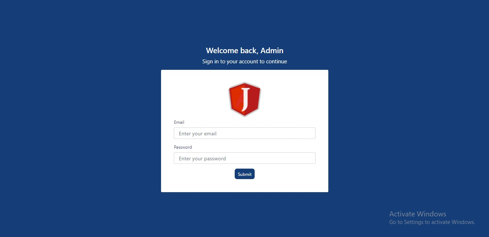
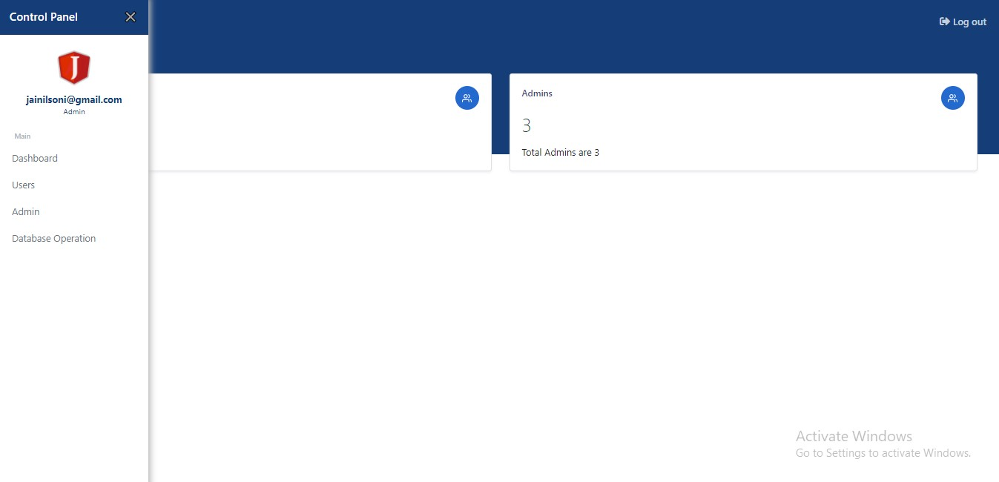
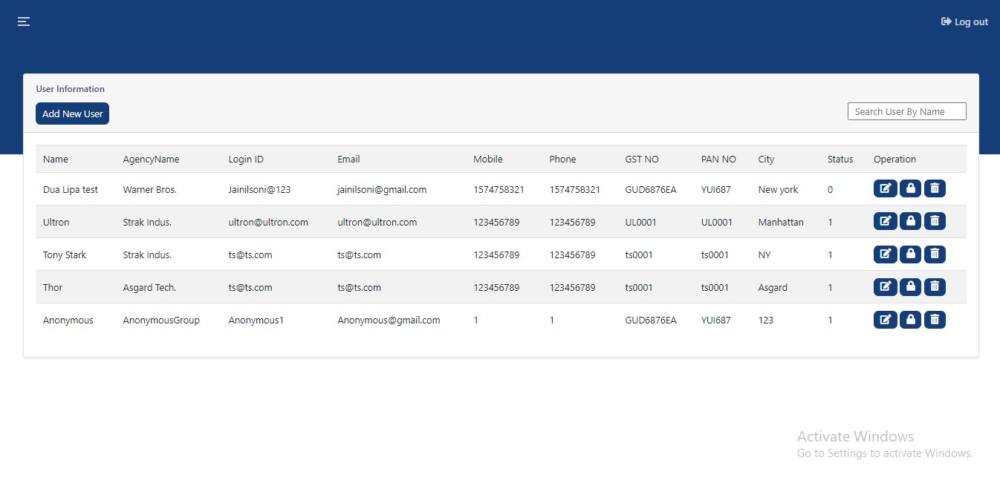
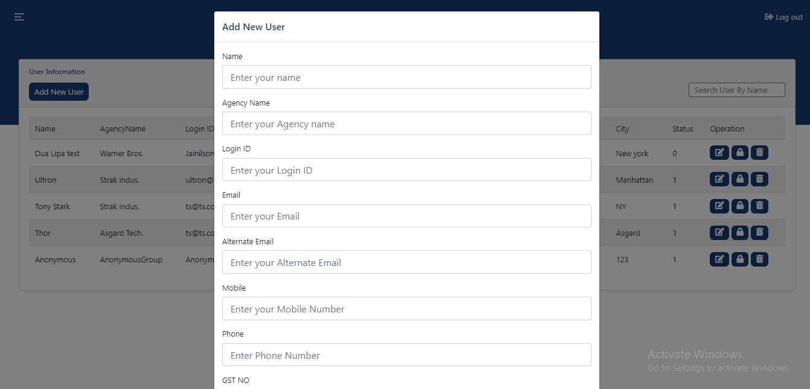
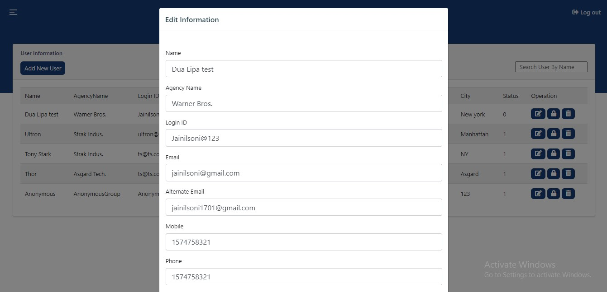
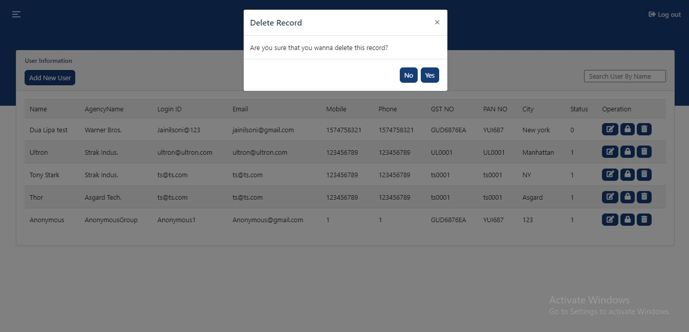
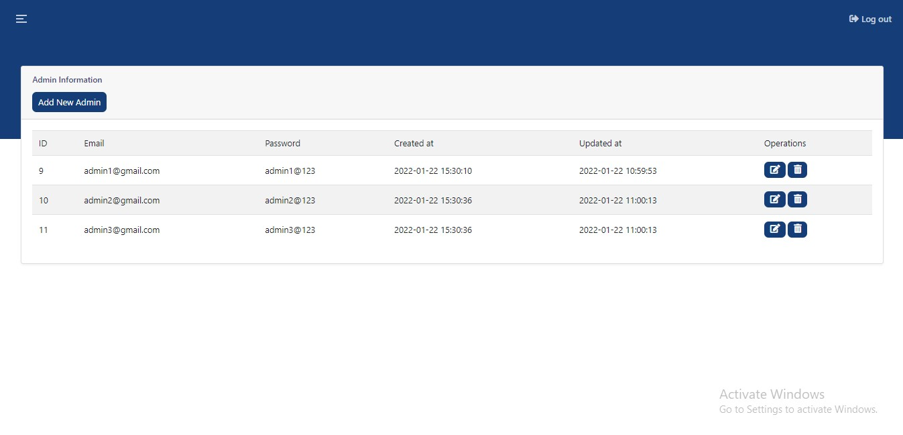
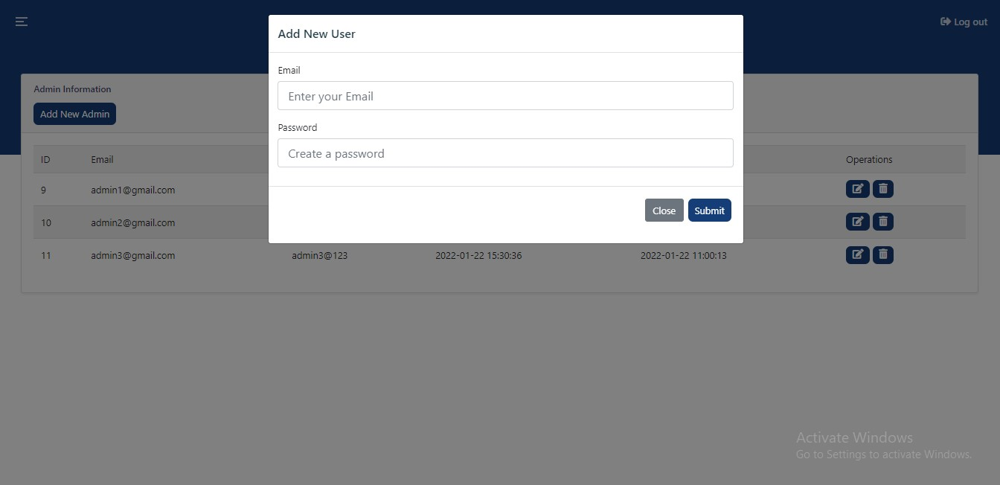
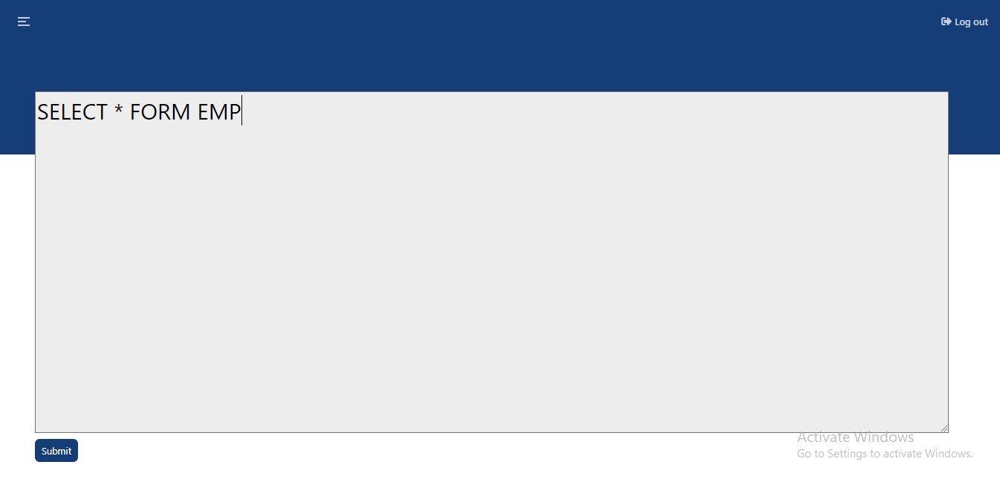

# laraveladminpanel

Hello There it's me jainil soni,
Here i've made a simple admin panel in laravel.

Features:
It has Super Admin
It has Admins
Insert,Update and Delete data facilities.
It has an editor to perform the SQL queries

How to Download:
You must have composer and laravel installed in your system,
if you don't have then install both.
Then Download 2 files, 1st is 'admin' file and 2nd is 'ta' file.
Now Extract the 'admin' file and put it into your xampp/htdocs folder then creatae a database named 'ta' and import the 'ta' file in your phpmyadmin.
that's all now run this panel on your local machine.

